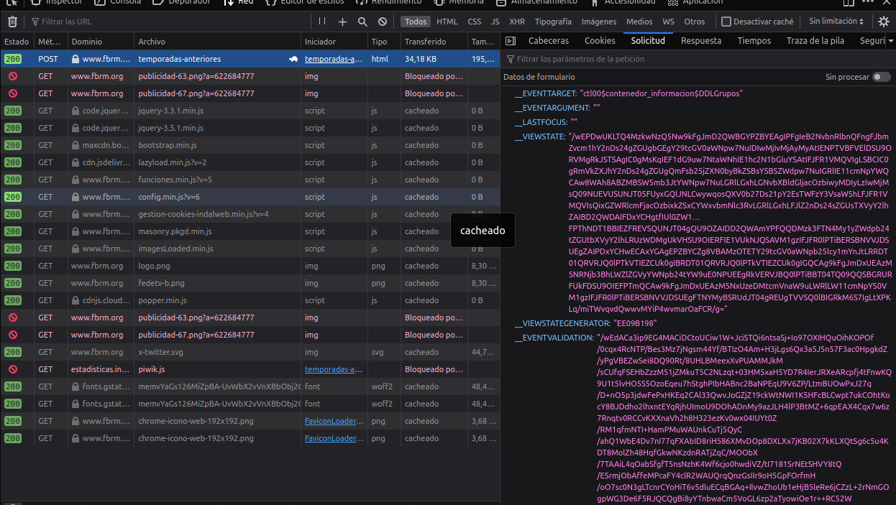

# Análisis de datos equipos 2a Autonómica Región de Murcia

## Configuración y Uso

### Instalación de dependencias

```bash
sudo apt install pipenv
```

### Configuración del entorno virtual

```bash
pipenv install
```

## Web Scraping

Obtener los datos de la página de la [Federación de baloncesto de la Región de Murcia](https://www.fbrm.org/temporadas-anteriores).

Esta web está desarrollada en ASP.NET, por lo que supone un problema obtener los datos por la forma en la que se recarga la página al actualizar los formularios, puesto que manda una petición POST con el valor _VIEWSTATE que es una cadena de texto enorme. Por este motivo he decidido usar `scrapy` en lugar de `BeautifulSoup`



### Configurar Scrapy

Inicializar el proyecto de scrapy

```bash
scrapy startproject my_project
```

Crear una nueva "spider"

```bash
scrapy genspider fede https://www.fbrm.org/temporadas-anteriores
```

Ejecutar la "spider", hay que situarse en el directorio raiz "fede_scrape"

```bash
scrapy crawl results
```

> Configuración de Pipelines para guardar datos ["Write items to a JSON lines file"](https://docs.scrapy.org/en/latest/topics/item-pipeline.html#write-items-to-a-json-lines-file)
